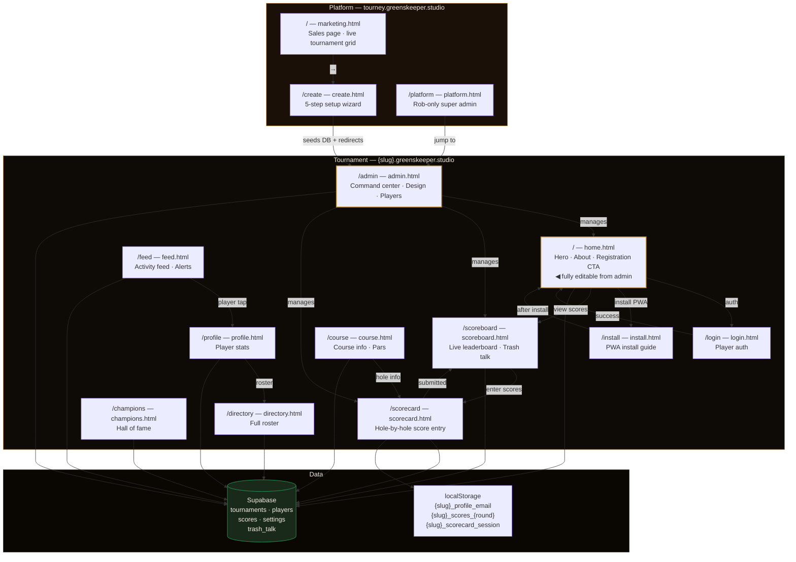

# TOURney — Page Flow Diagram

```mermaid
flowchart TD
    subgraph PLATFORM["Platform — tourney.greenskeeper.studio"]
        MKTG["/ — marketing.html\nSales page · live tournament grid"]
        CREATE["/create — create.html\n5-step setup wizard"]
        PLAT["/platform — platform.html\nRob-only super admin"]
    end

    subgraph TOURNAMENT["Tournament — {slug}.greenskeeper.studio"]
        HOME["/ — home.html\nHero · About · Registration CTA\n◀ fully editable from admin"]
        ADMIN["/admin — admin.html\nCommand center · Design · Players"]
        LOGIN["/login — login.html\nPlayer auth"]
        INSTALL["/install — install.html\nPWA install guide"]
        SCOREBOARD["/scoreboard — scoreboard.html\nLive leaderboard · Trash talk"]
        SCORECARD["/scorecard — scorecard.html\nHole-by-hole score entry"]
        FEED["/feed — feed.html\nActivity feed · Alerts"]
        PROFILE["/profile — profile.html\nPlayer stats"]
        DIRECTORY["/directory — directory.html\nFull roster"]
        COURSE["/course — course.html\nCourse info · Pars"]
        CHAMPS["/champions — champions.html\nHall of fame"]
    end

    subgraph DATA["Data"]
        SB[("Supabase\ntournaments · players\nscores · settings\ntrash_talk")]
        LS["localStorage\n{slug}_profile_email\n{slug}_scores_{round}\n{slug}_scorecard_session"]
    end

    MKTG -->|"→"| CREATE
    CREATE -->|"seeds DB + redirects"| ADMIN
    PLAT -->|"jump to"| ADMIN

    ADMIN -->|"manages"| HOME
    ADMIN -->|"manages"| SCOREBOARD
    ADMIN -->|"manages"| SCORECARD

    HOME -->|"auth"| LOGIN
    HOME -->|"install PWA"| INSTALL
    HOME -->|"view scores"| SCOREBOARD
    INSTALL -->|"after install"| HOME
    LOGIN -->|"success"| HOME

    SCOREBOARD -->|"enter scores"| SCORECARD
    SCORECARD -->|"submitted"| SCOREBOARD

    FEED -->|"player tap"| PROFILE
    PROFILE -->|"roster"| DIRECTORY
    COURSE -->|"hole info"| SCORECARD

    HOME & ADMIN & SCOREBOARD & SCORECARD & FEED & PROFILE & DIRECTORY & COURSE & CHAMPS --> SB
    SCORECARD --> LS

    style PLATFORM fill:#1a1008,stroke:#c09030,color:#f5ede0
    style TOURNAMENT fill:#0e0b06,stroke:#c09030,color:#f5ede0
    style DATA fill:#0a0703,stroke:#444,color:#f5ede0
    style SB fill:#1a2a1a,stroke:#27ae60,color:#f5ede0
    style ADMIN stroke:#c09030,stroke-width:2px
    style HOME stroke:#c09030,stroke-width:2px
```
